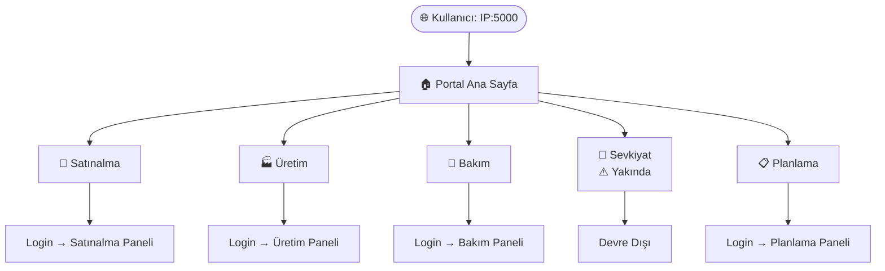
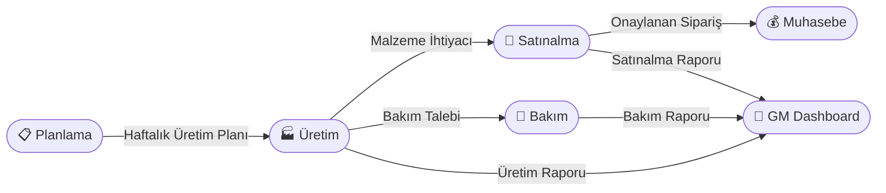
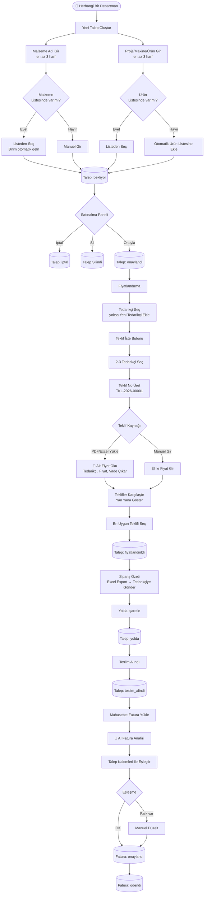
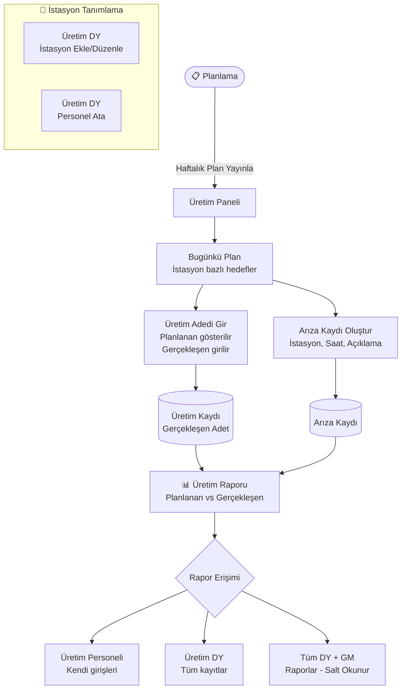
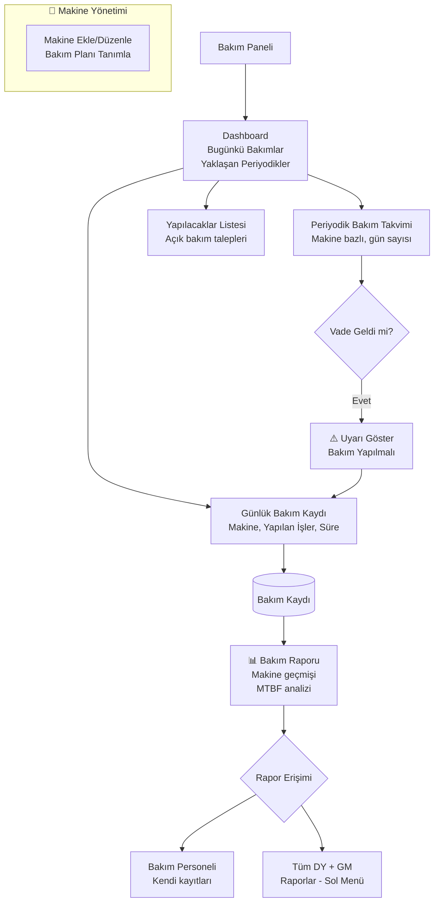
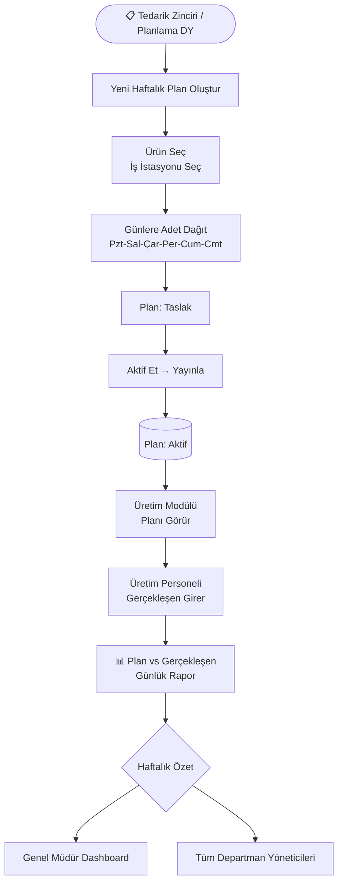
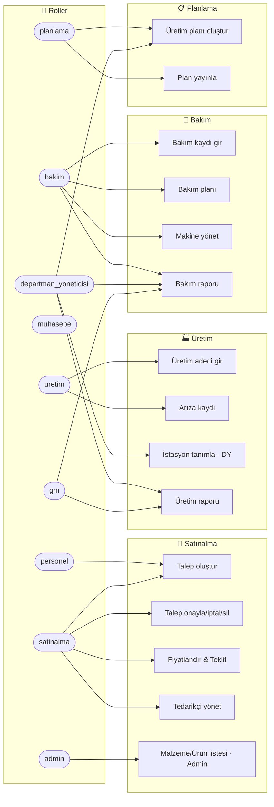
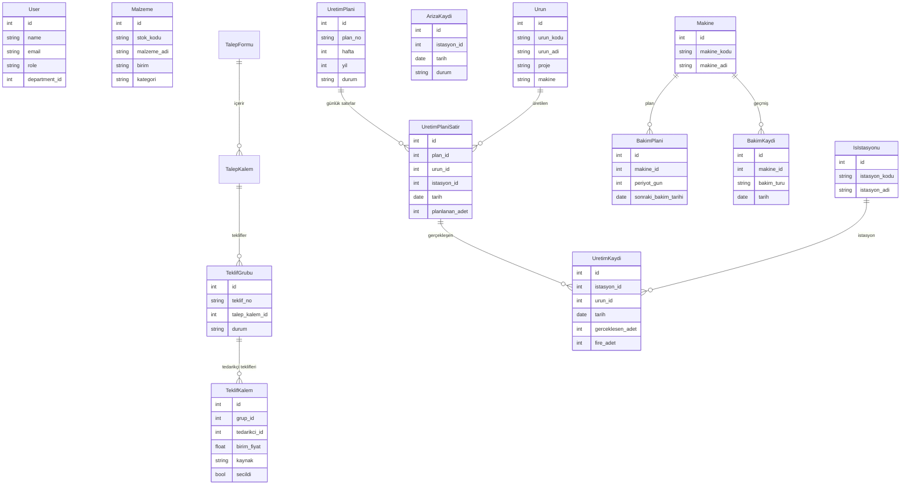
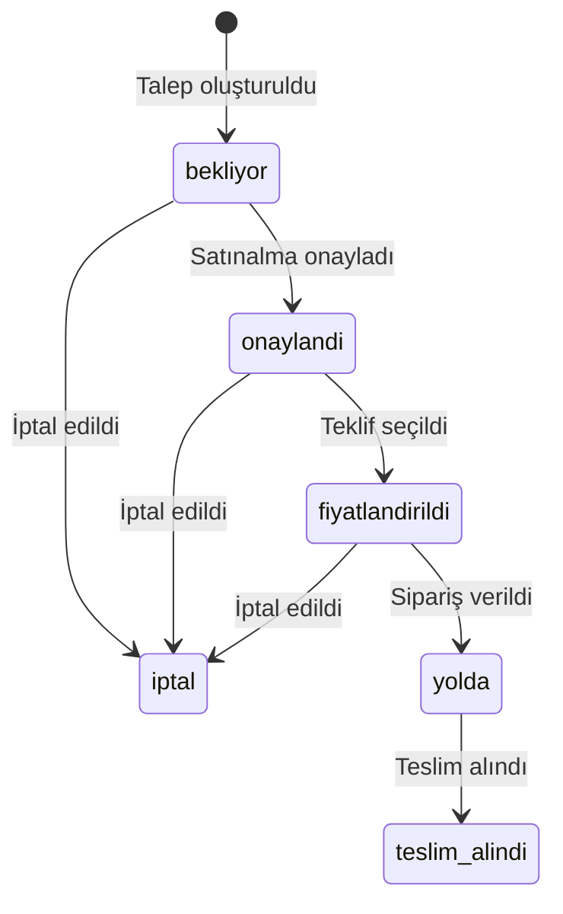
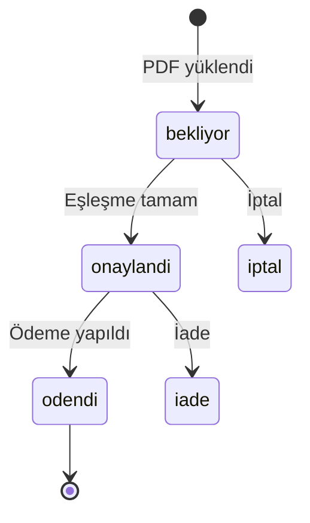

# Erlau App — Sistem Akışı

> Düzenlemek için: [mermaid.live](https://mermaid.live) adresine gidip aşağıdaki kodu yapıştır.
> GitHub bu dosyayı otomatik render eder.

---

## 0. Portal — Ana Giriş Sayfası

---

## 1. Modüller Arası İletişim

---

## 2. Satınalma Akışı (Güncel)

---

## 3. Üretim Akışı

---

## 4. Bakım Akışı

---

## 5. Planlama Akışı

---

## 6. Kullanıcı Rolleri ve Erişim (Güncel)

---

## 7. Veri Modeli (Güncel)

---

## 8. Talep Durumları (Mevcut)

---

## 9. Fatura Durumları (Mevcut)

