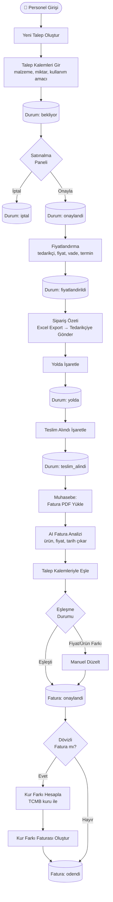
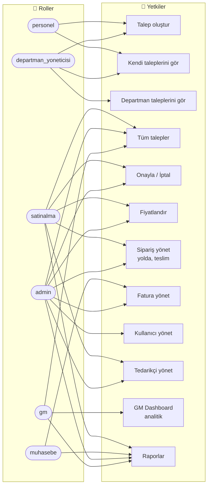
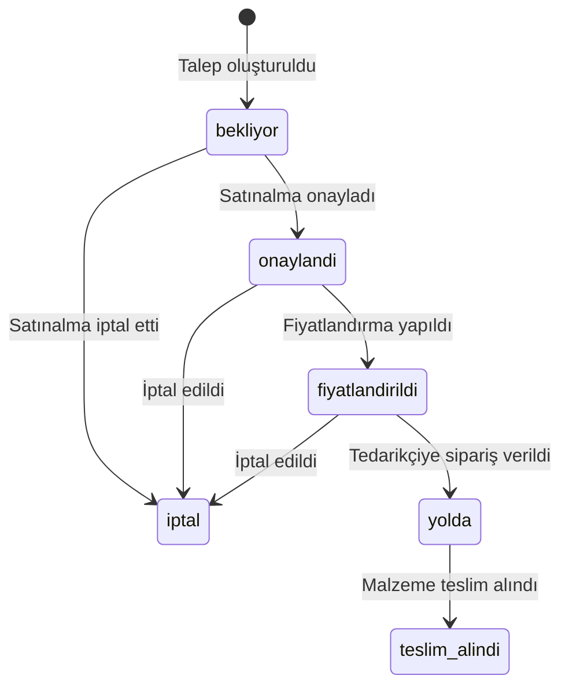
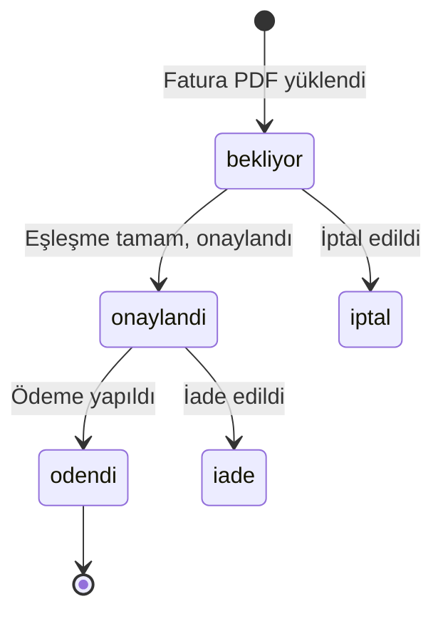
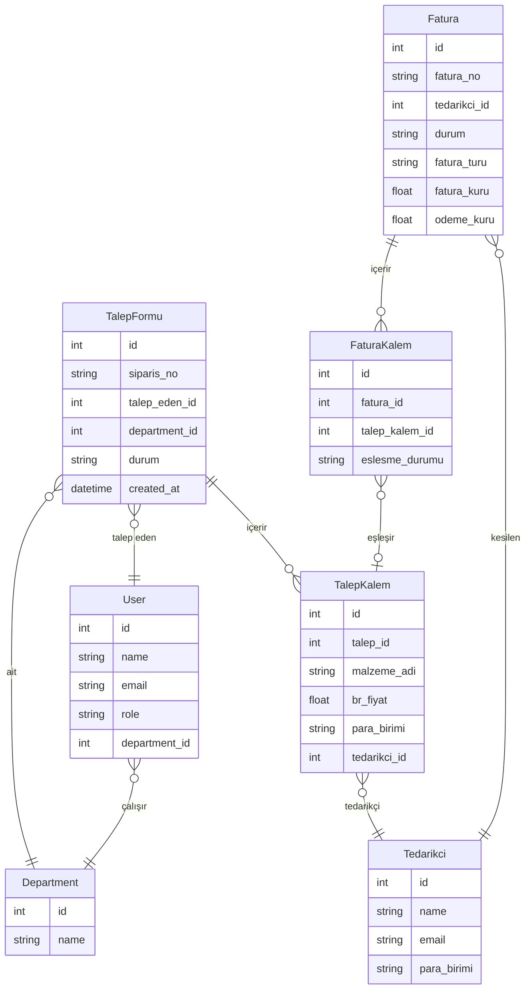

# Erlau App — Sistem Akışı

> Düzenlemek için: [mermaid.live](https://mermaid.live) adresine gidip aşağıdaki kodu yapıştır.  
> VS Code'da canlı önizleme: `Markdown Preview Mermaid Support` eklentisini kur.  
> GitHub bu dosyayı otomatik render eder.

---

## 1. Ana İş Akışı

---

## 2. Kullanıcı Rolleri ve Yetkileri

---

## 3. Talep Durumları

---

## 4. Fatura Durumları

---

## 5. Modüller ve Veri Modeli

